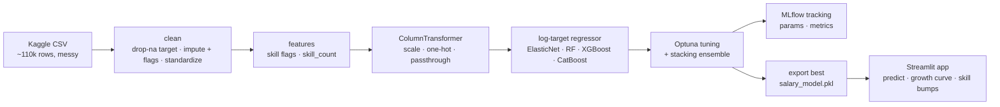

<div align="center">

# 💼 Tech Salary Predictor (India)

### Predicting Indian tech salaries with a tuned, stacked regression pipeline


[](https://tech-salary-advisor.streamlit.app/)

-success)


</div>

---

## At a glance

[🚀 Try the live app](https://tech-salary-advisor.streamlit.app/)
· [📓 EDA notebook](notebooks/EDA.ipynb)
· [📓 Modeling notebook](notebooks/Salary_Prediction.ipynb)

- **Task:** Estimate the annual salary (INR) of an Indian tech role from experience, education, location, and skills.
- **Best model:** a stacking ensemble of tuned XGBoost and CatBoost with a ridge meta-model.
- **Held-out result:** R² **0.885**, MAE **₹1.55 LPA** on a 21.5k-row test split.
- **Main finding:** experience, role, and education explain most of the variation; individual skill flags add very little once those are known.

## 📌 Overview

This project predicts tech salaries in India end to end: explore the data, decide how to clean it,
engineer features, compare models, tune and stack the best ones, track everything with MLflow, and
serve the winner through a Streamlit app.

The reusable logic lives in a small `src/` package so the notebooks and the training script share one
source of truth. Cleaning, feature building, and the pipeline are each one import away, and the whole
run is reproducible from `python -m src.train`.

The dataset is the [Indian Tech Salaries](https://www.kaggle.com/datasets/ashishprajapati223/indian-tech-salaries/data)
set on Kaggle (~110k rows). It arrives messy on purpose, so a fair chunk of the work is cleaning it
before any model sees it.

---

## 📊 Model results

Trained on 86,188 rows and evaluated on a 21,547-row held-out split (80/20, `random_state=42`). The
target is log-transformed during training and inverted for reporting, so every number below is in
rupees.

| # | Model | R² | MAE (₹) | MAPE |
|---|-------|:--:|:------:|:----:|
| 1 | ElasticNet | 0.7822 | 216,985 | 0.142 |
| 2 | Random Forest | 0.8195 | 192,827 | 0.126 |
| 3 | XGBoost | 0.8754 | 160,726 | 0.106 |
| 4 | CatBoost | 0.8843 | 155,713 | 0.103 |
| 5 | Tuned XGBoost (Optuna) | 0.8802 | 157,981 | 0.105 |
| 6 | Tuned CatBoost (Optuna) | 0.8841 | 155,354 | 0.103 |
| **7** | **Stacking (deployed)** | **0.8845** | **155,173** | **0.103** |

The gradient-boosted models cluster tightly near R² 0.88; stacking the two tuned learners edges out
every single model, so it is the one shipped in the app.

> Metrics are point estimates from one training run with a fixed seed. Variation across seeds has not
> been measured.

### What drives the prediction

Permutation importance on the held-out split ranks the features clearly:

| Feature | Relative importance |
|---|---|
| Experience_Years | highest |
| Job_Title | high |
| Education_Level | moderate |
| Location | moderate |
| Individual skills / skill_count | marginal |

Experience and role dominate. This is why the app's "skill bump" suggestions move the estimate only a
little: in this data, the skill flags carry far less signal than the career basics.

---

## 🧠 Key decisions (and the reasoning)

Each choice below is driven by what the data showed in [`EDA.ipynb`](notebooks/EDA.ipynb), and is
implemented once in `src/` so training and the notebooks stay in sync.

- **Drop rows with no salary, impute the rest.** ~2k rows have no target and are dropped. Every
  feature column is missing for ~5% of rows, so experience is filled with the median, categoricals
  with the mode, and skills with a sensible default. A "was missing" flag is kept per column in case
  missingness itself carries signal.
- **Log-transform the target.** Salary is right-skewed (skew 0.85); `log1p` pulls it to near-symmetric
  (skew −0.27). Training on the log target and inverting on predict (`TransformedTargetRegressor`)
  stabilises the fit and stops the high-salary tail from dominating the error.
- **Cap training outliers.** About 2% of salaries sit past the 1.5×IQR fence. The training target is
  clipped to that fence; the test split is left untouched so evaluation stays honest.
- **Standardize messy text.** `noida`, `Noida`, and `NOIDA` collapse to one city; `btech`, `B.Tech`,
  and `bachelors` collapse to one degree. Synonym job titles map to a fixed set.
- **Engineer `skill_count` and skill flags.** The comma-separated `Skills` string becomes one binary
  column per known skill plus a count of listed skills.
- **Tune, then stack.** XGBoost and CatBoost are tuned with Optuna (Bayesian search over
  cross-validated R²), then stacked with a ridge meta-model. Every model and trial is logged to MLflow.

---

## 🗂️ Notebooks

| Notebook | What it covers |
|----------|----------------|
| [`EDA.ipynb`](notebooks/EDA.ipynb) | Loads the raw data and works through each cleaning decision: missing values, the salary skew that motivates the log transform, the IQR outlier check, text standardization, and what actually drives salary. |
| [`Salary_Prediction.ipynb`](notebooks/Salary_Prediction.ipynb) | Reproduces the cleaning and features from `src/`, builds the pipeline, compares the baselines, and points to `python -m src.train` for the full Optuna + stacking run. Loads the exported model to show the deployed metrics. |

Both import from `src/`, so the notebooks and the shipped model use identical logic.

---

## 🏗️ Pipeline



---

## 🚀 Quickstart

```bash
# 1. install
pip install -r requirements.txt

# 2. run the tests
make test           # or: pytest -q

# 3. train, tune, and export the best model  (a few minutes)
make train          # or: python -m src.train
make train-fast     # tiny Optuna budget, for a quick end-to-end check

# 4. launch the app
make app            # or: streamlit run streamlit/app.py

# 5. browse the experiment runs
make mlflow
```

The trained model ships in `streamlit/models/`, so the app runs without retraining.

---

## 📁 Repository structure

```
Tech-Salary-Advisor/
├── config.yaml                    # data paths, skills, features, tuning budget, output paths
├── data/
│   └── salary_dataset_dirty.csv   # the raw dataset (see Dataset)
├── src/
│   ├── config.py                  # loads config.yaml
│   ├── data.py                    # load + clean (impute, flags, standardize, IQR cap)
│   ├── features.py                # skill flags + skill_count
│   ├── pipeline.py                # ColumnTransformer + log-target regressor
│   ├── evaluate.py                # MAE / RMSE / R² / MAPE / adjusted R²
│   └── train.py                   # baselines → Optuna → stacking → MLflow → export
├── tests/
│   ├── test_data.py               # cleaning + imputation + outlier capping
│   └── test_features.py           # skill parsing + feature construction
├── notebooks/
│   ├── EDA.ipynb                  # data exploration and decisions
│   └── Salary_Prediction.ipynb    # modeling walkthrough
├── streamlit/
│   ├── app.py                     # the prediction UI
│   └── models/
│       ├── salary_model.pkl       # deployed stacking pipeline
│       └── metadata.pkl           # feature order, skills, metrics, dropdown options
├── Makefile                       # install / test / train / app / mlflow
├── requirements.txt
├── packages.txt                   # system deps for Streamlit Cloud
└── README.md
```

---

## 📚 Dataset

| | |
|---|---|
| **Source** | [Indian Tech Salaries](https://www.kaggle.com/datasets/ashishprajapati223/indian-tech-salaries/data) (Kaggle) |
| **Size** | ~110,000 rows |
| **Target** | `Salary_INR` — annual salary in INR |
| **Features** | `Job_Title`, `Experience_Years`, `Education_Level`, `Location`, `Skills` (comma-separated) |

The raw file is intentionally messy: inconsistent casing, stray spaces, mixed education labels, skills
stored as one string, and missing values. Cleaning it is part of the exercise, and the steps are
documented in the EDA notebook and implemented in `src/data.py`.

---

## 🛠️ Tools

Built with pandas, NumPy, scikit-learn, XGBoost, CatBoost, Optuna, MLflow, and Streamlit.

The modeling techniques (target transforms, tuning, stacking, permutation importance) follow concepts
from CampusX's *100 Days of Machine Learning*.

## ⚖️ Limitations

This is an educational project. The salary figures come from a single public dataset, and the metrics
are from one training run with a fixed seed. Predictions are estimates, not offers, and should not be
used as the sole basis for compensation or hiring decisions.

## License

Released under the [MIT License](LICENSE). The dataset remains subject to its own terms on Kaggle.
