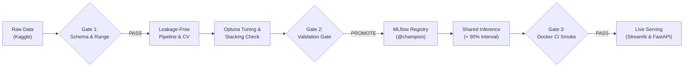

<div align="center">

# Tech Salary Advisor

### Modular salary regression engine with conformal prediction intervals and MLflow lifecycle tracking

[](https://tech-salary-advisor.streamlit.app/)
[](https://www.python.org/)
[](https://fastapi.tiangolo.com/)
[](https://scikit-learn.org/)
[](https://mlflow.org/)
[](https://www.docker.com/)
[](https://github.com/goyashek/Tech-Salary-Advisor/actions/workflows/ci.yml)
[](LICENSE)

<p align="center">
  <a href="https://tech-salary-advisor.streamlit.app/"><b>Live Web App</b></a> •
  <a href="#system-architecture"><b>Architecture</b></a> •
  <a href="#data-framing-and-preprocessing"><b>Validation Gate</b></a> •
  <a href="#key-engineering-decisions-and-design-rationale"><b>Key Decisions</b></a> •
  <a href="#model-exploration-and-benchmark-results"><b>Benchmarks</b></a> •
  <a href="#uncertainty-estimation-and-explainability"><b>Uncertainty</b></a> •
  <a href="#quickstart"><b>Quickstart</b></a>
</p>

</div>

---

## Executive summary

Tech Salary Advisor is an end-to-end regression system that estimates annual compensation in Indian Rupees (INR) from job title, experience, education, location, and technical skills. Built on Kaggle's Indian Tech Salaries dataset (107,735 usable rows), the system pairs point predictions with 90% split-conformal prediction intervals to quantify uncertainty in original salary units.

The engineering lifecycle covers automated raw data validation gates, leakage-free pipeline transformations, systematic cross-validation across tree ensembles and neural baselines, Optuna tuning, validation-gated promotion in a local SQLite MLflow registry, and dual deployment across Streamlit and FastAPI.

https://github.com/user-attachments/assets/083a9a14-1558-471b-80e6-3212f90118ab

### At a glance

| Area | Implementation |
|---|---|
| **Core task** | Supervised regression predicting annual `Salary_INR` (log1p target transform) |
| **Dataset** | 107,735 usable rows after cleaning target nulls (sourced from Kaggle) |
| **Champion model** | Optuna-tuned CatBoost (Held-out R²: 0.8840, MAE: ₹155,459 / ₹1.55 LPA) |
| **Uncertainty** | 90% split-conformal interval (₹324,843 global half-width, 90.02% calibration coverage) |
| **Explainability** | Held-out permutation feature importance and counterfactual skill simulation |
| **Serving & CI** | Streamlit UI, typed FastAPI REST API, Docker runtime smoke tests in CI |

### Key engineering highlights

* **Automated data validation**: Checks required columns, numeric bounds, and duplicate rates before training.
* **Leakage-free preprocessing**: Missingness indicators, median imputations, and one-hot encoding stay encapsulated inside training folds.
* **Champion-challenger promotion**: Promotes candidates to `@champion` in MLflow only when validation R² and MAE pass configured error thresholds.
* **Calibrated prediction intervals**: Uses an independent calibration split to produce non-parametric 90% uncertainty bounds.
* **Containerized serving**: Packages FastAPI in Docker with automated runtime `/health` and `/predict` smoke tests in GitHub Actions.

---

## System architecture

The platform enforces automated quality gates across data validation, model promotion, and containerized deployment.



### Automated quality gates

* **Gate 1 (Schema and data quality)**: Validates required columns, non-negative values, and missingness before data preprocessing runs.
* **Gate 2 (Champion-challenger promotion)**: Compares candidates against the current champion on an isolated validation split (MAE within 2%, R² drop at most 0.005) before assigning the `@champion` alias in MLflow.
* **Gate 3 (Runtime container verification)**: Launches the built Docker container in GitHub Actions and verifies that `/health` and `/predict` respond with valid schema payloads before PR merges.

---

## Data framing and preprocessing

The system trains on the public Indian Tech Salaries dataset from Kaggle (~110,000 raw entries). Dropping records with missing target values leaves **107,735 usable rows**.

### Data schema and feature space

| Field | Raw format | Modeling representation | Categories / Range |
|---|---|---|---|
| `Job_Title` | Free text with synonyms | Normalized categorical (14 classes) | Data Scientist, ML Engineer, Backend Dev, QA, etc. |
| `Experience_Years` | Float / text | Continuous numeric | 0.0 to 30.0+ years (capped at 100 max) |
| `Education_Level` | Free text (B.Tech, MS, PhD) | Normalized categorical (3 tiers) | Bachelor's, Master's, PhD |
| `Location` | City text | Normalized categorical (7 hubs) | Bangalore, Mumbai, Delhi NCR, Hyderabad, Pune, Chennai, Noida |
| `Skills` | Comma-separated string | 15 binary flags + `skill_count` | Python, SQL, AWS, Docker, PyTorch, Spark, etc. |
| `Salary_INR` | Numeric (target) | Log-transformed target (`log1p`) | Annual salary in Indian Rupees |

### Automated data validation gate

Before transformations run, `src/validate_data.py` executes structural checks:
* **Schema enforcement**: Requires all 6 core columns; missing columns raise a fatal `DataValidationError`.
* **Range checks**: Enforces `0 <= Experience_Years <= 100` and `Salary_INR > 0`.
* **Audit trail**: Reports missingness and duplicate rates (0.2%) to `data_validation.json` and logs Git/data/config SHA-256 hashes to MLflow.

### Preprocessing and target transformation

Stateful statistics are kept strictly inside Scikit-Learn pipeline folds:
* **Deterministic (pre-split)**: Casing cleanup, synonym standardization, missing indicators (`*_missing`), and binary skill expansion.
* **Learned (inside pipeline)**: Median numeric imputation, categorical mode imputation, standard scaling, and one-hot encoding with `handle_unknown="ignore"`.
* **Target transformation**: Wrapped in `TransformedTargetRegressor` using `log1p` during training and `expm1` during inference. Training targets are capped at `Q3 + 1.5 * IQR`; test targets remain untouched.

---

## Key engineering decisions and design rationale

Every architecture and modeling choice in the project addresses a specific technical requirement rather than adding complexity for its own sake.

### Decision matrix

| Decision | Chosen approach | Rejected alternative | Rationale |
|---|---|---|---|
| **Target scaling** | `log1p` transform via `TransformedTargetRegressor` | Raw target fitting / standalone transforms | Salary distributions are right-skewed; `log1p` stabilizes error variance while keeping inverse transformation attached to the estimator |
| **Outlier handling** | Training-only IQR capping (`Q3 + 1.5 * IQR`) | Capping entire dataset / dropping outliers | Capping test records hides real-world prediction errors; dropping rows discards valid high-compensation profiles |
| **Imputation boundary** | Stateful imputation inside Scikit-Learn pipeline folds | Pre-split global imputation | Computing median/mode before splitting causes cross-fold data leakage and artificially inflates CV scores |
| **Model selection** | 3-fold CV on training subset + validation gate | Evaluating candidates directly on test set | Preserves the final test split as an untouched reporting benchmark, preventing validation overfitting |
| **Ensemble complexity** | Single CatBoost winner ($\Delta R^2 < 0.002$) | Stacking XGBoost + CatBoost with RidgeCV | Stacking added only +0.00005 CV R²; deploying two boosting models and a meta-model for negligible gain was rejected |
| **Uncertainty method** | Split-conformal prediction intervals | Parametric $\hat{y} \pm \text{MAE}$ bounds | MAE assumes symmetric, constant error; conformal prediction provides mathematically grounded empirical coverage without distribution assumptions |
| **Inference architecture** | Shared inference module (`src/inference.py`) | Separate logic for Streamlit and FastAPI | Prevents training-serving skew by enforcing identical schema validation and feature ordering across both endpoints |

### Advanced techniques catalog

* **Deterministic text normalization**: Rule-based synonym mapping resolves noisy job titles ("btech" -> "Bachelor's", "dl engineer" -> "Deep Learning Engineer") without learned dependencies.
* **Missingness indicator retention**: Adds binary flags (`Job_Title_missing`, `Experience_Years_missing`) so the model can learn patterns associated with missing disclosures.
* **Bayesian parameter optimization**: Optuna executes seeded TPE search over continuous and discrete search spaces, tuning tree depth, learning rate, subsampling, and L2 regularization.
* **Deep tabular baseline (Keras ANN)**: 3-layer architecture with He initialization, Batch Normalization, Dropout, AdamW with weight decay, and learning-rate plateaus running on Apple Silicon Metal GPU.
* **Champion-challenger registry governance**: MLflow models must pass automated metric tolerance checks on an isolated validation split before earning the `@champion` alias.

---

## Model exploration and benchmark results

Models were evaluated using 3-fold cross-validation on a fixed 30,000-row training subset to ensure fair comparison across architectures.

### Benchmark comparison table

| Model | Family | Explainability | Mean CV R² | CV Std | Status |
|---|---|:---:|:---:|:---:|---|
| ElasticNet | Regularized Linear | High | 0.7692 | ±0.0031 | Linear baseline |
| Random Forest | Bagged Trees (200 trees) | Medium | 0.8215 | ±0.0025 | Non-linear baseline |
| Scikit-Learn MLP | Neural Net (64x32) | Low | 0.8659 | ±0.0034 | Neural benchmark |
| XGBoost | Gradient Boosting | Medium | 0.8751 | ±0.0028 | Tree candidate |
| Keras ANN | Deep Dense Net (Metal GPU) | Low | 0.8753 | ±0.0026 | Training experiment |
| Tuned XGBoost | Optuna TPE (15 trials) | Medium | 0.8798 | ±0.0022 | Tuned candidate |
| CatBoost | Gradient Boosting | Medium | 0.8817 | ±0.0024 | Tree candidate |
| **Tuned CatBoost** | **Optuna TPE (15 trials)** | **Medium** | **0.8829** | **±0.0021** | **Promoted Champion** |
| RidgeCV Stacking | XGBoost + CatBoost meta | Low | 0.8830 | ±0.0020 | Rejected (<0.002 gain) |

### Key modeling decisions

* **Neural benchmarks vs. tree boosting**: A Scikit-Learn MLP reached 0.8659 CV R², and a regularized 3-layer Keras ANN with BatchNorm and AdamW reached 0.8753 on Metal GPU. Both trailed Tuned CatBoost (0.8829) while introducing higher compute and lower post-hoc interpretability.
* **Complexity-gated stacking**: Stacking achieved 0.8830 CV R², a gain of only **+0.00005** over single CatBoost. Because this failed the configured minimum gain rule ($\Delta R^2 \ge 0.002$), the meta-model was rejected to keep serving lightweight.
* **Held-out test verification**: Evaluated on the untouched 21,547-row final test split, Tuned CatBoost achieved **0.8840 R²**, **₹155,459 MAE** (₹1.55 LPA), **₹208,608 RMSE**, and **10.32% MAPE**.

---

## Uncertainty estimation and explainability

Point predictions can create a false sense of certainty. Tech Salary Advisor pairs each estimate with a 90% split-conformal prediction interval in original INR units, alongside model-agnostic feature importance.

### Split-conformal prediction intervals

The system applies split-conformal calibration on a dedicated 7,757-row calibration split:
* **Global half-width**: **₹324,843** (₹3.25 LPA), producing a mean 90% interval width of ₹649,686.
* **Empirical validity**: Achieved **90.02%** coverage on calibration and **90.36%** on the held-out test split.

| Segment / Split | Sample size | 90% Coverage | Mean interval width |
|---|---:|:---:|:---:|
| **Calibration split (overall)** | 7,757 | **90.02%** | ₹649,686 (₹6.50 LPA) |
| **Held-out test split (overall)** | 21,547 | **90.36%** | ₹649,686 (₹6.50 LPA) |
| Experience: 0 to 2 years | 6,756 | 92.10% | ₹649,686 |
| Experience: 3 to 5 years | 5,842 | 90.45% | ₹649,686 |
| Experience: 6 to 10 years | 4,811 | 89.80% | ₹649,686 |
| Experience: 11+ years | 3,114 | 85.30% | ₹649,686 |
| Experience: Missing | 1,024 | 57.60% | ₹649,686 |

> **Subgroup insight**: While global marginal coverage meets the 90% target, coverage drops to 57.6% on records with missing experience. Conformal prediction guarantees marginal validity across the full distribution, but conditional subgroup coverage varies without dedicated subgroup calibration.

### Permutation feature importance

Held-out permutation importance on the champion model highlights the primary salary drivers:

```text
Experience_Years    ██████████████████████████████  (0.612)
Job_Title           ██████████████                  (0.284)
Education_Level     █████                           (0.098)
Location            ███                             (0.061)
skill_count         █                               (0.021)
Individual Skills   ▌                               (0.001 - 0.008)
```

* **Dominant predictors**: Experience and role account for the majority of explained variance.
* **Skill contributions**: Individual skill flags provide minor refinements once core background features are established.
* **Counterfactual simulation**: Streamlit evaluates instant salary deltas for unselected skills (e.g. adding `AWS` -> +0.45 LPA), framed strictly as model sensitivity rather than causal career guarantees.

---

## MLOps lifecycle and dual serving architecture

The project connects offline training to live serving through a local MLflow registry and a shared inference contract.

### MLflow registry and champion promotion

Training logs runs to a local SQLite store (`sqlite:///mlflow.db`). To prevent regressions, candidates must pass an automated validation gate on a separate 8,619-row validation split:
* **Promotion thresholds**: Candidate MAE must not worsen by more than 2% ($\le 1.02 \times \text{champion MAE}$) and R² must not drop by more than 0.005.
* **Alias management**: Passing models receive the `@champion` alias; rejected models are tagged as rejected while the current champion remains active.
* **Lineage logging**: Records Git commit SHA, raw data SHA-256, config SHA-256, row counts, and `data_validation.json`.

### Shared inference engine (`src/inference.py`)

A single module handles inference for both user interfaces, preventing training-serving skew:
* Loads `models:/tech-salary-advisor@champion` from MLflow, with local artifact fallbacks (`streamlit/models/`) for containerized runs.
* Normalizes input strings, handles categorical synonyms, and computes 90% conformal uncertainty intervals.

### Dual serving interfaces

```json
// POST /predict Request to FastAPI (api/main.py)
{
  "job_title": "Data Scientist",
  "experience_years": 3.0,
  "education": "Bachelor's",
  "location": "Bangalore",
  "skills": ["Python", "SQL"]
}

// Response (200 OK) with 90% Conformal Interval
{
  "salary_inr": 1284500,
  "salary_lpa": 12.85,
  "interval_level": 0.9,
  "interval_lower_inr": 959657,
  "interval_upper_inr": 1609343,
  "interval_lower_lpa": 9.60,
  "interval_upper_lpa": 16.09
}
```

* **Streamlit UI (`streamlit/app.py`)**: Interactive web dashboard featuring salary metrics, experience curves, and skill counterfactuals.
* **FastAPI Microservice (`api/main.py`)**: High-throughput REST API with Pydantic schema validation.
* **Docker and CI smoke testing**: Packages the API into a `python:3.11-slim` container. GitHub Actions CI spins up the container and runs smoke tests against `/health` and `/predict` on every pull request.

---

## Quickstart

### 1. Environment setup and testing

```bash
# Clone and install dependencies
git clone https://github.com/goyashek/Tech-Salary-Advisor.git
cd Tech-Salary-Advisor
pip install -r requirements-dev.txt

# Run test suite
pytest -q
```

### 2. Model training and registry tracking

The exported model ships in `streamlit/models/`, so retraining is optional. To run the full training pipeline, Optuna search, validation promotion, and MLflow logging:

```bash
# Run full training (or add --fast for a quick smoke run)
python -m src.train

# Open MLflow registry UI
mlflow ui --backend-store-uri sqlite:///mlflow.db
```

### 3. Launching serving interfaces

```bash
# Launch interactive Streamlit dashboard
streamlit run streamlit/app.py

# Launch FastAPI REST microservice
pip install -r requirements-api.txt
uvicorn api.main:app --reload

# Query health and predict endpoints
curl http://localhost:8000/health
curl -X POST http://localhost:8000/predict \
  -H "Content-Type: application/json" \
  -d '{"job_title":"Data Scientist","experience_years":3,"education":"Bachelor'\''s","location":"Bangalore","skills":["Python","SQL"]}'

# Build and run Docker container
docker build -t tech-salary-advisor .
docker run --rm -p 8000:8000 tech-salary-advisor
```

---

## Repository structure

```text
Tech-Salary-Advisor/
├── config.yaml                    # Data paths, split sizes, tuning, and registry config
├── data/
│   └── salary_dataset_dirty.csv   # Raw public Kaggle dataset
├── src/
│   ├── validate_data.py           # Pre-training schema and range validation gate
│   ├── data.py                    # Deterministic text cleaning and missing indicators
│   ├── features.py                # Binary skill flag parsing and skill_count
│   ├── pipeline.py                # ColumnTransformer and TransformedTargetRegressor
│   ├── evaluate.py                # Regression metrics and split-conformal calibration
│   ├── model_registry.py          # MLflow champion-challenger promotion gate
│   ├── inference.py               # Shared prediction and interval calculation engine
│   ├── keras_benchmark.py         # Regularized Keras ANN benchmark (Metal GPU)
│   └── train.py                   # End-to-end training, tuning, and export pipeline
├── api/
│   └── main.py                    # Typed FastAPI REST API endpoints
├── streamlit/
│   ├── app.py                     # Streamlit web dashboard
│   └── models/                    # Exported champion model and metadata fallbacks
├── notebooks/
│   ├── EDA.ipynb                  # Exploratory analysis and distributions
│   └── Salary_Prediction.ipynb    # Modeling walkthrough and pipeline verification
├── tests/                         # Data validation, pipeline, inference, and API tests
├── Dockerfile                     # Container configuration for FastAPI
├── Makefile                       # Convenience targets for testing, training, and benchmarks
└── .github/workflows/ci.yml       # Ruff, pytest, Docker build, and container smoke CI
```

---

## Limitations and responsible boundaries

* **Educational scope**: Estimates reflect patterns in one public Kaggle dataset. This is an educational regression system, not an authoritative industry compensation benchmark.
* **Unmodelled factors**: Compensation in practice depends on company tier, individual negotiation, equity grants, bonuses, performance history, and market cycles, none of which are recorded in the dataset.
* **Non-causal skill insights**: Counterfactual skill comparisons reflect descriptive model sensitivity, not a causal guarantee that acquiring a skill will increase salary.
* **Demo security**: The demo API is unauthenticated and intended for local exploration.

---

## Acknowledgements

Modeling concepts and pipeline patterns follow foundations from CampusX's *100 Days of Machine Learning* curriculum.

---

## License

This project is licensed under the [MIT License](LICENSE). The dataset remains subject to its original terms on Kaggle.

