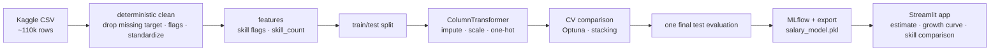

<div align="center">

# 💼 Tech Salary Predictor (India)

### Predicting Indian tech salaries with a tuned, stacked regression pipeline


[](https://tech-salary-advisor.streamlit.app/)

-success)


</div>

---

## At a glance

[🚀 Try the live app](https://tech-salary-advisor.streamlit.app/)
· [📓 EDA notebook](notebooks/EDA.ipynb)
· [📓 Modeling notebook](notebooks/Salary_Prediction.ipynb)

- **Task:** Estimate annual salary (INR) for common Indian tech roles from experience, education, location, and skills.
- **Best model:** a stacking ensemble selected using cross-validation on the training split.
- **Held-out result:** R² **0.8849**, MAE **₹1.55 LPA** on a 21,547-row test split.
- **Main finding:** experience, role, and education explain most of the variation; individual skill flags add very little once those are known.

## 📌 Overview

An end-to-end machine learning project for salary estimation across common technology roles in India.
It covers data exploration, feature engineering, model comparison, MLflow tracking, and a Streamlit
app.

The `src/` package contains the cleaning, feature, pipeline, evaluation, and training code used by the
notebooks. Run the seeded training flow with `python -m src.train`.

The project uses the [Indian Tech Salaries](https://www.kaggle.com/datasets/ashishprajapati223/indian-tech-salaries/data)
dataset from Kaggle (~110k rows). The file contains inconsistent text labels and missing values, which
are handled in the shared training pipeline.

---

## 📊 Model results

Models were compared with three-fold cross-validation on a fixed 30,000-row subset of the training
data. The 21,547-row test split stayed untouched until stacking had the strongest mean CV R².

| Model | Mean CV R² | Std. dev. |
|-------|:----------:|:---------:|
| ElasticNet | 0.7745 | 0.0022 |
| Random Forest | 0.8248 | 0.0013 |
| XGBoost | 0.8771 | 0.0021 |
| CatBoost | 0.8829 | 0.0021 |
| Tuned XGBoost (Optuna) | 0.8808 | 0.0015 |
| Tuned CatBoost (Optuna) | 0.8838 | 0.0020 |
| **Stacking (selected)** | **0.8838** | **0.0020** |

After selection, stacking was fitted on all 86,188 training rows and evaluated once on the held-out
test set: R² **0.8849**, MAE **₹155,014**, RMSE **₹207,766**, and MAPE **10.31%**.

> These are results from one seeded training run. Variation across seeds has not been measured.

### What drives the prediction

Permutation importance on the held-out split ranks the features clearly:

| Feature | Relative importance |
|---|---|
| Experience_Years | highest |
| Job_Title | high |
| Education_Level | moderate |
| Location | moderate |
| Individual skills / skill_count | marginal |

Experience and role dominate. This is why the app's "skill bump" suggestions move the estimate only a
little: in this data, the skill flags carry far less signal than the career basics.

---

## 🧠 Key decisions (and the reasoning)

Each choice below is driven by what the data showed in [`EDA.ipynb`](notebooks/EDA.ipynb), and is
implemented once in `src/` so training and the notebooks stay in sync.

- **Drop rows with no salary, impute the rest.** 2,265 rows have no target and are dropped. Missing
  indicators are added before splitting. Median and most-frequent imputers are fitted inside the
  sklearn pipeline, so each CV fold learns them from its own training rows.
- **Log-transform the target.** Salary is right-skewed (skew 0.85); `log1p` pulls it to near-symmetric
  (skew −0.27). Training on the log target and inverting on predict (`TransformedTargetRegressor`)
  stabilises the fit and stops the high-salary tail from dominating the error.
- **Cap training outliers.** About 2% of salaries sit past the 1.5×IQR fence. The training target is
  clipped to that fence; the test split is left untouched so evaluation stays honest.
- **Standardize messy text.** `noida`, `Noida`, and `NOIDA` collapse to one city; `btech`, `B.Tech`,
  and `bachelors` collapse to one degree. Synonym job titles map to a fixed set.
- **Engineer `skill_count` and skill flags.** The comma-separated `Skills` string becomes one binary
  column per known skill plus a count of listed skills.
- **Tune, then stack.** XGBoost and CatBoost are tuned with Optuna, then stacked with a ridge
  meta-model. Candidate CV scores, final test metrics, and exported artifacts are logged to MLflow.

---

## 🗂️ Notebooks

| Notebook | What it covers |
|----------|----------------|
| [`EDA.ipynb`](notebooks/EDA.ipynb) | Loads the raw data and works through each cleaning decision: missing values, the salary skew that motivates the log transform, the IQR outlier check, text standardization, and what actually drives salary. |
| [`Salary_Prediction.ipynb`](notebooks/Salary_Prediction.ipynb) | Reproduces the cleaning and features from `src/`, builds the pipeline, compares the baselines, and points to `python -m src.train` for the full Optuna + stacking run. Loads the exported model to show the deployed metrics. |

Both import from `src/`, so the notebooks and the shipped model use identical logic.

---

## 🏗️ Pipeline



---

## 🚀 Quickstart

```bash
# 1. install
pip install -r requirements-dev.txt

# 2. run the tests
make test           # or: python -m pytest -q

# 3. train, tune, and export the best model  (a few minutes)
make train          # or: python -m src.train
make train-fast     # tiny Optuna budget, for a quick end-to-end check

# 4. launch the app
make app            # or: streamlit run streamlit/app.py

# 5. browse the experiment runs
make mlflow
```

The trained model ships in `streamlit/models/`, so the app runs without retraining.

---

## 📁 Repository structure

```
Tech-Salary-Advisor/
├── config.yaml                    # data paths, skills, features, tuning budget, output paths
├── data/
│   └── salary_dataset_dirty.csv   # the raw dataset (see Dataset)
├── src/
│   ├── config.py                  # loads config.yaml
│   ├── data.py                    # load + deterministic cleanup, flags, IQR cap
│   ├── features.py                # skill flags + skill_count
│   ├── pipeline.py                # ColumnTransformer + log-target regressor
│   ├── evaluate.py                # MAE / RMSE / R² / MAPE / adjusted R²
│   └── train.py                   # baselines → Optuna → stacking → MLflow → export
├── tests/
│   ├── test_data.py               # cleaning + imputation + outlier capping
│   ├── test_features.py           # skill parsing + feature construction
│   └── test_train.py              # CV-based model selection
├── notebooks/
│   ├── EDA.ipynb                  # data exploration and decisions
│   └── Salary_Prediction.ipynb    # modeling walkthrough
├── streamlit/
│   ├── app.py                     # the prediction UI
│   └── models/
│       ├── salary_model.pkl       # deployed stacking pipeline
│       └── metadata.pkl           # feature order, skills, metrics, dropdown options
├── Makefile                       # install / test / train / app / mlflow
├── requirements.txt
├── requirements-dev.txt
├── packages.txt                   # system deps for Streamlit Cloud
└── README.md
```

---

## 📚 Dataset

| | |
|---|---|
| **Source** | [Indian Tech Salaries](https://www.kaggle.com/datasets/ashishprajapati223/indian-tech-salaries/data) (Kaggle) |
| **Size** | ~110,000 rows |
| **Target** | `Salary_INR`: annual salary in INR |
| **Features** | `Job_Title`, `Experience_Years`, `Education_Level`, `Location`, `Skills` (comma-separated) |

The raw file has inconsistent casing, stray spaces, mixed education labels, skills stored as one
string, and missing values. The EDA notebook documents these issues, and `src/data.py` contains the
deterministic cleanup.

---

## 🛠️ Tools

Built with pandas, NumPy, scikit-learn, XGBoost, CatBoost, Optuna, MLflow, and Streamlit.

The modeling techniques (target transforms, tuning, stacking, permutation importance) follow concepts
from CampusX's *100 Days of Machine Learning*.

## ⚖️ Limitations

This is an educational project. The salary figures come from a single public dataset, and the metrics
are from one training run with a fixed seed. Predictions are estimates, not offers, and should not be
used as the sole basis for compensation or hiring decisions.

## License

Released under the [MIT License](LICENSE). The dataset remains subject to its own terms on Kaggle.
